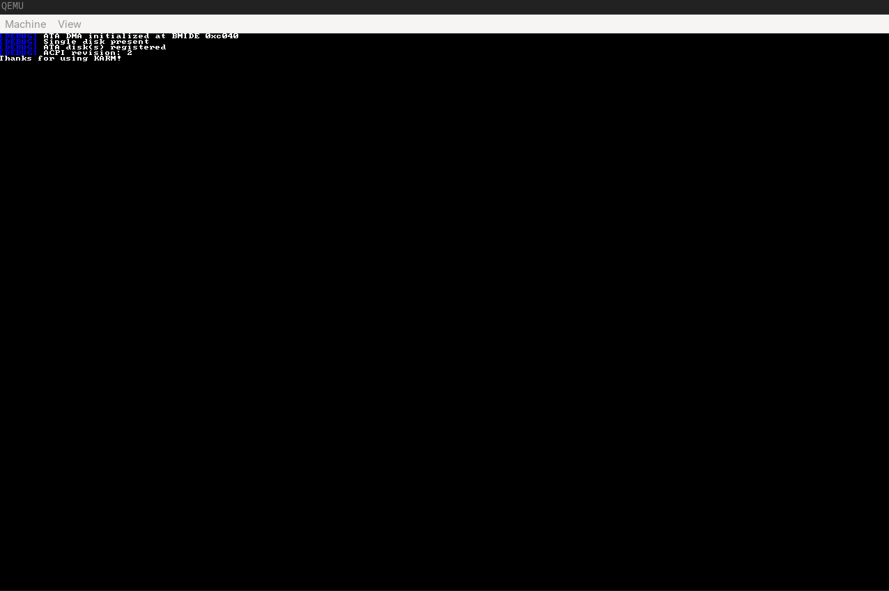

# What is KARM

A hobbyist OS, KARM (which stands for 'Kernel Almost Reaching Milestones'), is a kernel that I have been developing since early december 2025. I have learned quite a lot in my journey so far, how to properly do recursive paging is the biggest one, its quite hard, but rewarding once implemented. The design is quite simple, a pure monolithic kernel, you enable what you need, compile time.

The system boots via the Limine boot protocol, it uses standard x86_64 paging, and has many features in the works. It used to have a FATFS driver but I am overhauling large chunks of the system. The systems security model is quite simple, the userland only knows what we let it know, no more, and no less. The API is planned to be a custom API as POSIX is quite hard, while this will make implementing a C standard library in the userspace harder, it will make design far easier on the kernels end.

The languages chosen are C++ and C (with small bits of NASM assembly), the C++ is written like C code, but with namespaces. I am currently working on ACPI, and ACPI 2.0+ implementations. The VMM is, as mentioned earlier, largely complete. I also have a CSPRNG (as it implements both forwards and backwards secrecy, and uses 512bit internal states, with a 64bit output.) but it is mostly unused for now.

The design philosophy is simple, do it, refine it, and pray to the x86_64 gods that it runs. Hacks are acceptable but not wanted in favor of cleaner looking code.

